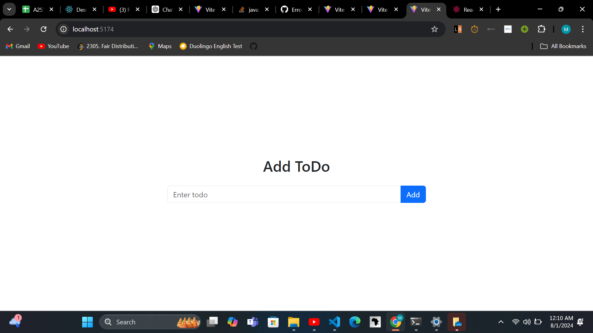
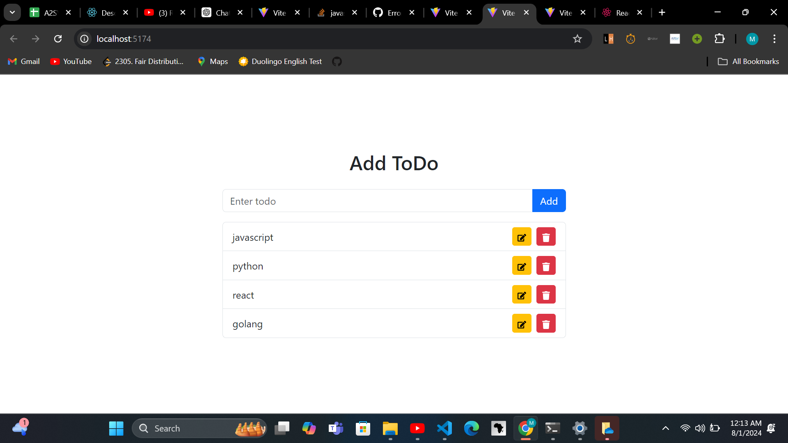
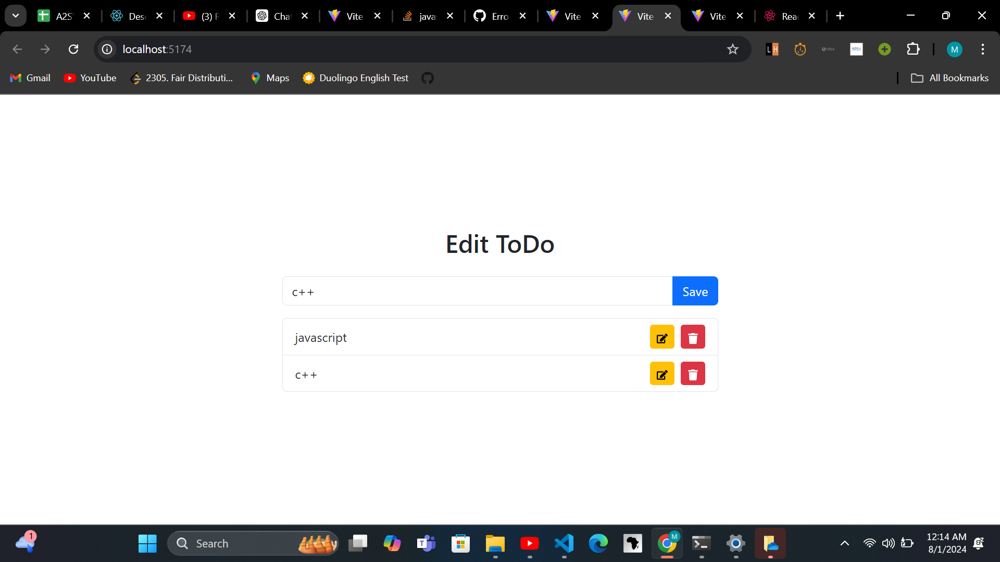
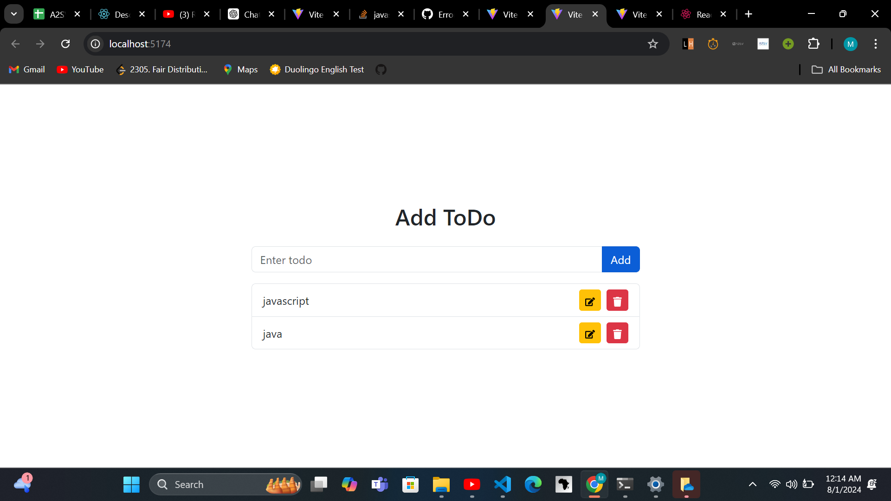
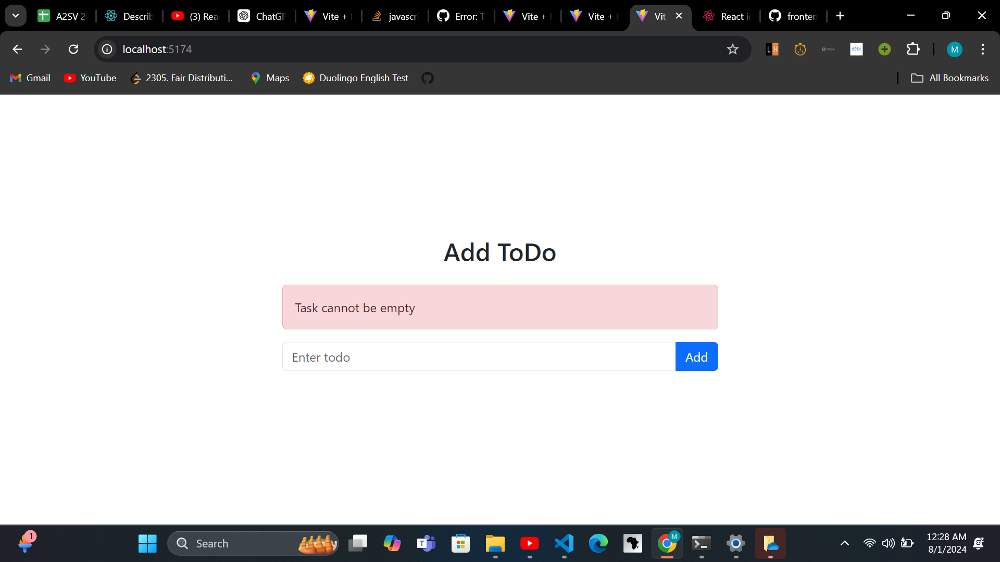
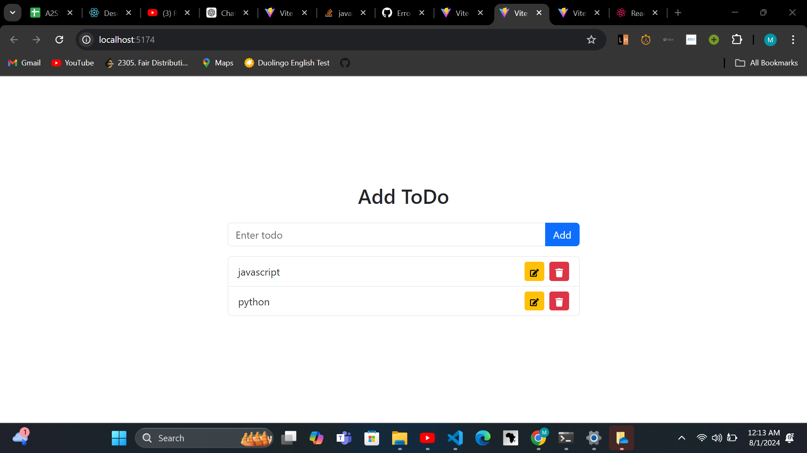

# Todo List

A simple Todo list website using react and type_scrip

#Functionality

Add new Task: you can add new task to work on and you can see it. 
errror: when ur yask is empty and u try t add empty task it will give u an error You can 
delete task: when the task is completed you can delete it. 
You can edit task: you can edit task Title and description using edit button
# demo

# landing page when user added the task

# when user want to edit the task

# after edit task

# popup error message when empty task is added

# delete task

